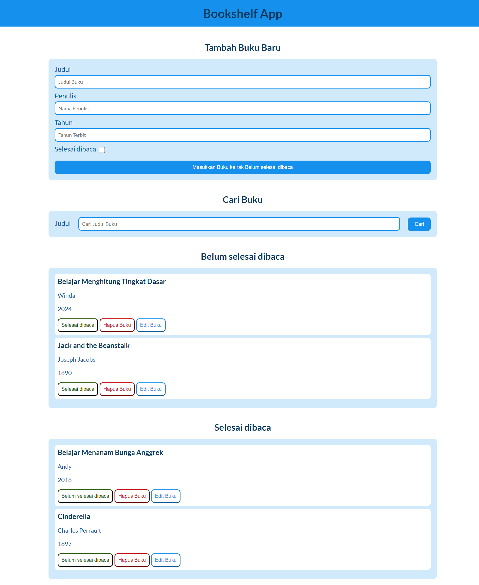

# Proyek Akhir Front End Pemula Dicoding
Dari kelas "[Belajar Membuat Front-End Web untuk Pemula](https://www.dicoding.com/academies/315-belajar-membuat-front-end-web-untuk-pemula)".

## Topik Proyek Akhir
Judul: **Membangun Bookshelf App**

Implementasi:
1. BOM & DOM
2. Event
3. Web Storage (Local Storage)
4. DOM Manipulation

## Tampilan Akhir
